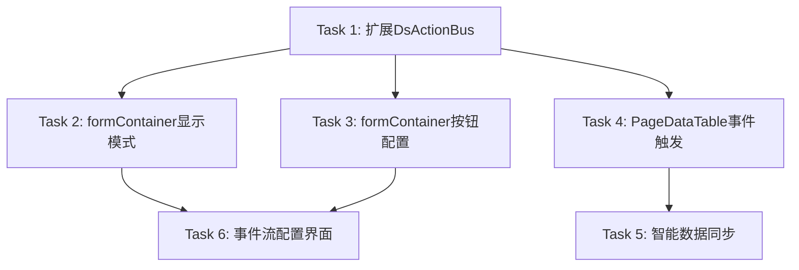

## Implementation Plan

### 阶段 1: 基础架构扩展

#### Task 1: 扩展DsActionBus事件和动作类型
**目标**：在DsActionBus中新增表格-容器联动的事件和动作类型

**步骤**：
1. 在DsActionBus.ts中新增事件类型定义：`row-edit`、`row-view`、`row-click`、`row-create`
2. 在DsActionBus.ts中新增动作类型定义：`open-container`、`load-record`、`save-container`、`close-container`
3. 更新DsLink接口，支持新的事件和动作类型
4. 更新DsStep接口，支持新的动作参数

**文件**：`frontend/src/views/form/components/DsActionBus.ts`

**验收标准**：
- [ ] DsActionBus支持注册新的事件类型
- [ ] DsActionBus支持执行新的动作类型
- [ ] 新增的事件和动作类型有完整的类型定义

**预计时间**：2小时

---

### 阶段 2: formContainer增强

#### Task 2: 增强formContainer显示模式
**目标**：formContainer支持多种显示形式（弹出窗口、新开页签、页面内嵌）

**步骤**：
1. 在formContainer.js中新增displayMode配置选项
2. 实现弹出窗口显示模式（dialog）
3. 实现新开页签显示模式（newTab）
4. 实现页面内嵌显示模式（inline）
5. 支持事件流覆盖默认显示模式

**文件**：`frontend/src/vendor/config/rule/formContainer.js`

**验收标准**：
- [ ] formContainer支持displayMode配置
- [ ] 默认使用弹出窗口显示
- [ ] 弹出窗口支持配置宽度和高度
- [ ] 新开页签支持配置标题
- [ ] 页面内嵌支持配置高度
- [ ] 事件流可以覆盖默认显示模式

**预计时间**：4小时

---

#### Task 3: 增强formContainer按钮配置
**目标**：formContainer支持默认按钮和自定义按钮配置

**步骤**：
1. 在formContainer.js中新增按钮配置选项
2. 实现默认按钮：新增、取消、确定、删除（默认隐藏）、复制（默认隐藏）
3. 实现按钮显示/隐藏配置
4. 实现自定义按钮配置
5. 实现按钮事件链配置

**文件**：`frontend/src/vendor/config/rule/formContainer.js`

**验收标准**：
- [ ] formContainer支持默认按钮显示
- [ ] 删除和复制按钮默认隐藏
- [ ] 支持配置按钮显示/隐藏
- [ ] 支持配置自定义按钮
- [ ] 支持配置按钮事件链

**预计时间**：3小时

---

### 阶段 3: 表格事件触发

#### Task 4: 增强PageDataTable事件触发
**目标**：PageDataTable支持触发表格-容器联动事件

**步骤**：
1. 在PageDataTable.vue中集成DsActionBus
2. 实现编辑按钮事件触发
3. 实现查看按钮事件触发
4. 实现行点击事件触发
5. 实现新增按钮事件触发

**文件**：`frontend/src/views/page/components/PageDataTable.vue`

**验收标准**：
- [ ] 点击编辑按钮触发row-edit事件
- [ ] 点击查看按钮触发row-view事件
- [ ] 点击行触发row-click事件
- [ ] 点击新增按钮触发row-create事件
- [ ] 事件包含当前行数据

**预计时间**：3小时

---

### 阶段 4: 数据同步

#### Task 5: 实现智能数据同步
**目标**：保存后智能同步表格中的对应行数据

**步骤**：
1. 在PageRendererPage.vue中实现保存后同步逻辑
2. 根据保存返回的记录ID查找表格中的对应行
3. 如果找到，更新该行数据
4. 如果未找到，刷新整个表格

**文件**：`frontend/src/views/page/PageRendererPage.vue`

**验收标准**：
- [ ] 保存成功后自动同步表格数据
- [ ] 同步逻辑正确处理新增和更新场景
- [ ] 同步失败时有错误处理

**预计时间**：2小时

---

### 阶段 5: 配置界面

#### Task 6: 创建事件流配置界面
**目标**：在页面设计器中创建事件流配置界面

**步骤**：
1. 在PageDesigner.vue中扩展事件配置面板
2. 添加表格-容器联动事件配置选项
3. 添加动作配置选项
4. 支持可视化配置和JSON高级配置

**文件**：`frontend/src/views/page/PageDesigner.vue`

**验收标准**：
- [ ] 页面设计器支持配置表格-容器联动事件
- [ ] 支持配置联动动作
- [ ] 支持可视化配置
- [ ] 支持JSON高级配置

**预计时间**：4小时

---

## 时间估算

| 阶段 | 任务 | 预计时间 |
|------|------|----------|
| 1 | 扩展DsActionBus事件和动作类型 | 2小时 |
| 2 | 增强formContainer显示模式 | 4小时 |
| 2 | 增强formContainer按钮配置 | 3小时 |
| 3 | 增强PageDataTable事件触发 | 3小时 |
| 4 | 实现智能数据同步 | 2小时 |
| 5 | 创建事件流配置界面 | 4小时 |
| **总计** | | **18小时** |

---

## 依赖关系

---

## 并行执行策略

- **Task 2 和 Task 3**：可以并行执行（都依赖 Task 1）
- **Task 4**：可以与 Task 2、Task 3 并行执行（都依赖 Task 1）
- **Task 5**：依赖 Task 4，需要等待 Task 4 完成
- **Task 6**：依赖 Task 1、Task 2、Task 3，需要等待这些任务完成

---

## 风险与缓解

### 风险1：向后兼容性
- **风险**：新增事件和动作可能影响现有功能
- **缓解**：确保现有功能不受影响，新增功能为可选配置

### 风险2：性能影响
- **风险**：频繁的事件分发可能影响性能
- **缓解**：使用防抖机制，避免频繁触发

### 风险3：状态同步问题
- **风险**：表格和formContainer状态可能不同步
- **缓解**：使用乐观锁机制，冲突时提示用户刷新

---

## 测试策略

### 单元测试
- DsActionBus事件和动作类型测试
- formContainer显示模式测试
- formContainer按钮配置测试

### 集成测试
- 表格-容器联动事件流测试
- 智能数据同步测试
- 事件流配置界面测试

### 端到端测试
- 完整的表格编辑流程测试
- 多种显示模式测试
- 自定义按钮测试

---

## 里程碑

### 里程碑 1: 基础架构完成
- 完成 Task 1: DsActionBus扩展
- 完成 Task 2: formContainer显示模式
- 完成 Task 3: formContainer按钮配置

### 里程碑 2: 事件触发完成
- 完成 Task 4: PageDataTable事件触发
- 完成 Task 5: 智能数据同步

### 里程碑 3: 配置界面完成
- 完成 Task 6: 事件流配置界面

### 里程碑 4: 测试与交付
- 完成所有测试
- 交付完整功能
